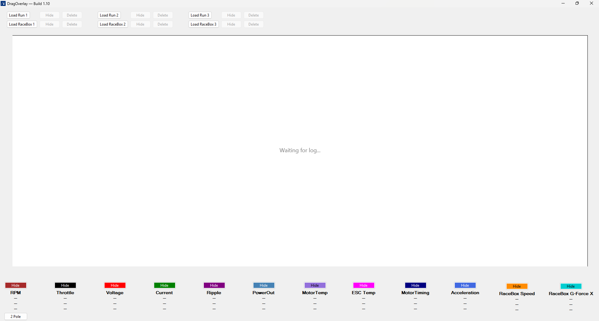
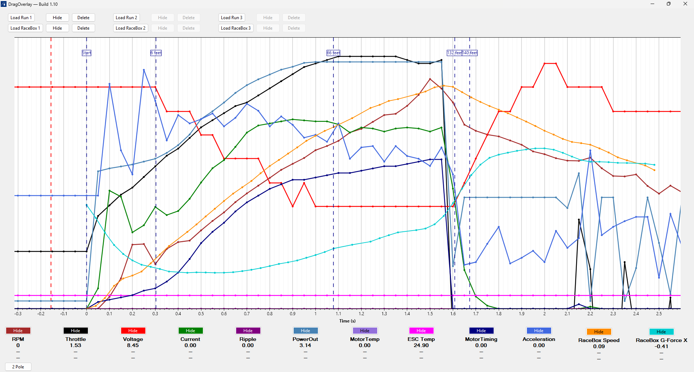
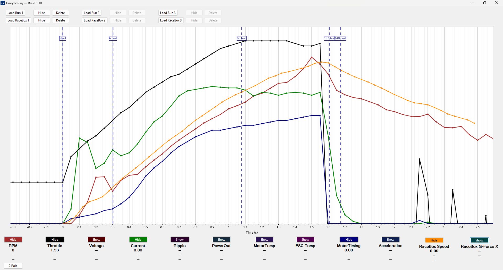
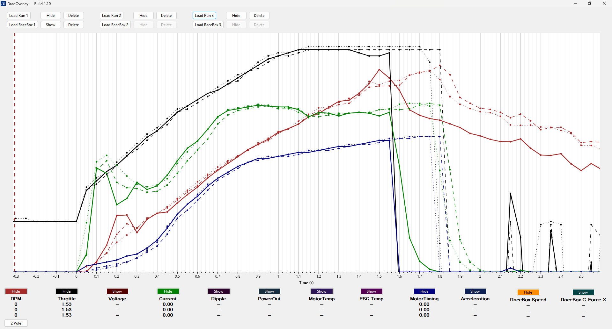

# DragOverlay


**DragOverlay** is a lightweight WinForms tool for visualizing Castle ESC data and RaceBox telemetry for RC drag racing. It overlays up to 3 Castle logs, optionally syncs RaceBox GPS data, and presents all runs on a shared ScottPlot chart — with hover, toggles, split lines, and Castle-style colors.

🎯 Inspired by Castle Link 2. Built for real racers.

---

## 🚀 Key Features

### 📦 Castle ESC Logs
- Overlay up to 3 Castle `.csv` logs
- Auto-align all runs to launch (`Throttle > 1.65ms` + `PowerOut > 10`)
- Castle-style line styles: blue/red/green with solid/dash/dot
- Per-channel toggles for:
  - RPM, Throttle, Voltage, Current, Ripple, PowerOut, ESC Temp, Motor Timing, Acceleration, GovGain
- ESC Temp mapped from `"Temperature"` column
- 2P / 4P RPM toggle (with hover + config persistence)
- Time trimming: keeps only -0.5s → +2.5s around launch
- Global X-axis offset for log tuning
- Hover cursor shows live Y-values for each visible channel + run
- Chart always stays clean — hidden axes, Castle-style layout

### 📍 RaceBox Integration
- Load 1 RaceBox log per Castle slot (Run 1–3)
- Aligns RaceBox telemetry to Castle launch time (t = 0)
- Plots:
  - RaceBox Speed (converted to mph)
  - RaceBox G-Force X
- Split time rendering for: 6ft, 66ft, 132ft, etc.
- Discipline labels appear at top of plot
- Toggle visibility + delete per RaceBox slot
- Color + line pattern matched to Castle slot
- Hover + axis logic fully supported

---

## 🖼 Screenshots

### 🏁 Overlay with Castle + RaceBox Logs


### 📍 Split Line Labels with Discipline Times


### 🎛️ Toggle Bar with Channel Visibility


### 🖱️ Hover Cursor with Real-Time Values


---

## ⚙️ Tech Stack

- **.NET 8** (WinForms)
- **ScottPlot v5.0.8** — charts, cursor, split lines
- **CsvHelper v33.1.0** — Castle log parser
- **Newtonsoft.Json** — config persistence

---

## 📁 Project Structure

| Folder                         | Purpose                                    |
|-------------------------------|--------------------------------------------|
| `/src/CastleOverlayV2/`       | Main app source code (UI, services, models)|
| `/src/CastleOverlayV2/Resources/` | Runtime icons + screenshots           |
| `/config/`                    | Local config.json (user preferences)       |
| `/docs/`                      | Features, delivery plan, structure docs    |
| `/logs/`                      | Test Castle CSV logs                       |

---

## 🛠️ How to Build

1. Clone this repo
2. Open `CastleOverlayV2.sln` in **Visual Studio 2022+**
3. Set `CastleOverlayV2` as the startup project
4. Build in **Release mode**
5. Run the generated `.exe` from `bin\Release\net8.0-windows\`

---

## 💾 Config System

On first launch, a config file is created:

```plaintext
AppData\Roaming\DragOverlay\config.json
