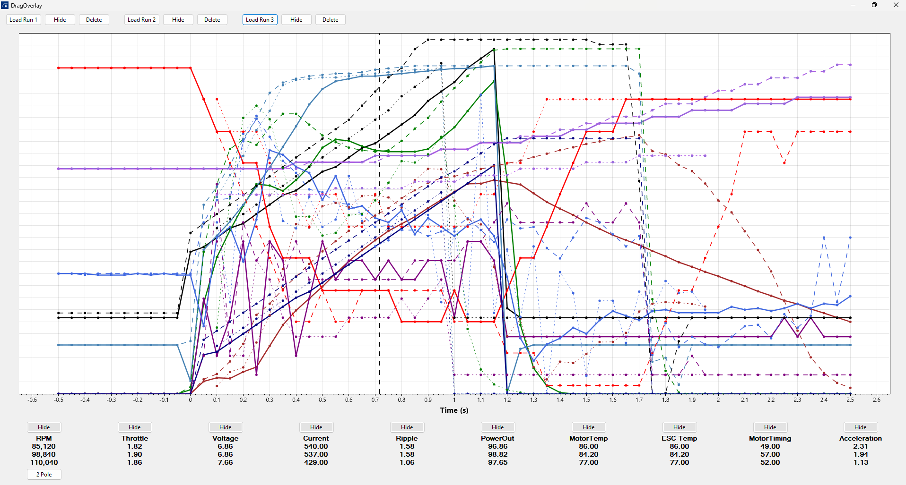
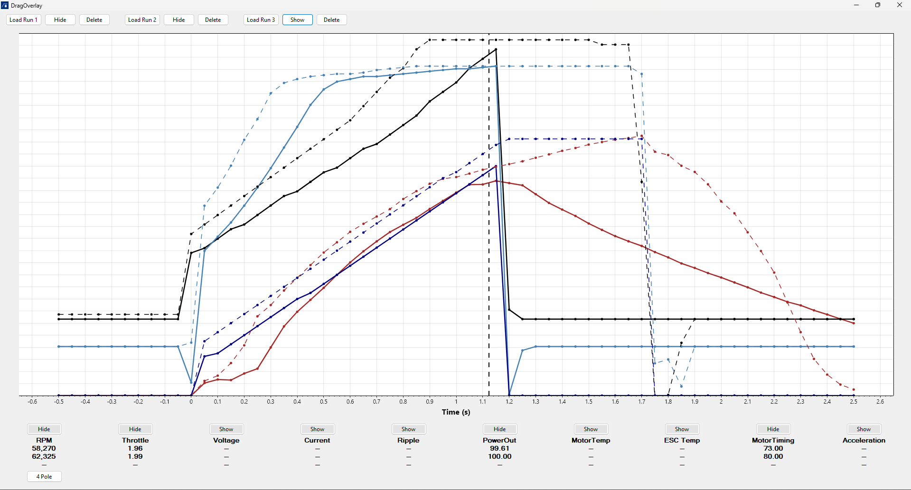

# DragOverlay

**DragOverlay** is a lightweight Windows tool built for RC drag racers using Castle ESCs. It overlays up to **3 Castle log files**, aligns them to launch, and presents a clean ScottPlot-based chart — with Castle Link 2–style colors, and toggles.

---

## 📊 Features

✅ Load and overlay **1–3 Castle `.csv` log files**  
✅ **Auto-align** runs to ESC launch (based on Throttle rise or Power Out)  
✅ Clean chart with **Castle-style channel colors** and **hover tooltips**  
✅ Toggle channels on/off dynamically  
✅ Hover shows real values for all visible runs  
✅ Supports 2P / 4P motor mode toggle (RPM scaling)  
✅ Saves preferences to `config.json`  

---

## 🖼 Screenshot

*Overlay of 3 Castle logs aligned to launch point*

*Dynamic per-channel toggling with live hover values*

---

## 🔧 Tech Stack

- **.NET 8 / WinForms**
- [ScottPlot v5](https://scottplot.net/)
- [CsvHelper](https://joshclose.github.io/CsvHelper/)
- `config.json` for persistent user defaults

---

## 🏁 How to Build

1. Clone this repo
2. Open `CastleOverlayV2.sln` in **Visual Studio 2022+**
3. Set `CastleOverlayV2` as the startup project
4. Build and run

---

## 📁 Folder Layout

| Folder     | Purpose                        |
|------------|--------------------------------|
| `/src/`    | Full source code (WinForms)    |
| `/config/` | App settings (`config.json`)   |
| `/logs/`   | Sample Castle `.csv` logs      |
| `/tests/`  | Working MWE for rollback       |
| `/docs/`   | FEATURES.md, STRUCTURE.md, etc.|

---

## ⚖ License

MIT — see [`LICENSE`](./LICENSE)

---

## 🏷 Tags

`Castle ESC` • `RC Drag Racing` • `ScottPlot` • `Data Overlay` • `WinForms` • `Telemetry Tools`

---

## 🙋‍♂️ Author

Made by **Stewart McMillan** for real-world RC testing and tuning.

Got a Castle log to compare? This tool makes it fast.
